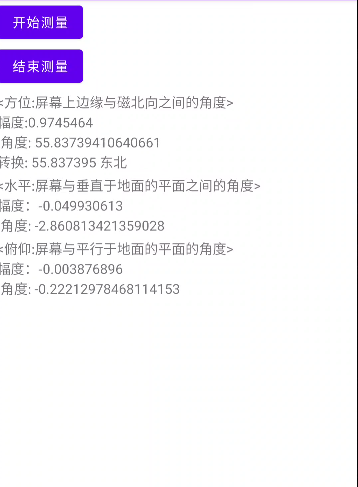

# sensor
Android设备传感器Sensor使用样例，真实场景：指南针，水平仪等等；

## 流程

```flow
 	sensorManager=>start: 获取服务
  sensor=>operation: 获取传感器
  sensorEventListener=>operation: 传感器事件
  register=>operation: 配置&注册监听
  unregister=>end: 注销
  
  sensorManager->sensor->sensorEventListener->register->unregister
```

* 获取传感器 & 注册监听 & 注销

  > ```
  > DegreeSensor
  > ```

* 监听事件

  > ```
  > DegreeSensorEventListner
  > ```

* 角度计算

  > ```
  > DegreeDataCal
  > ```

## 效果



## TODO

* [ ] 界面展示优化

## 详细介绍
